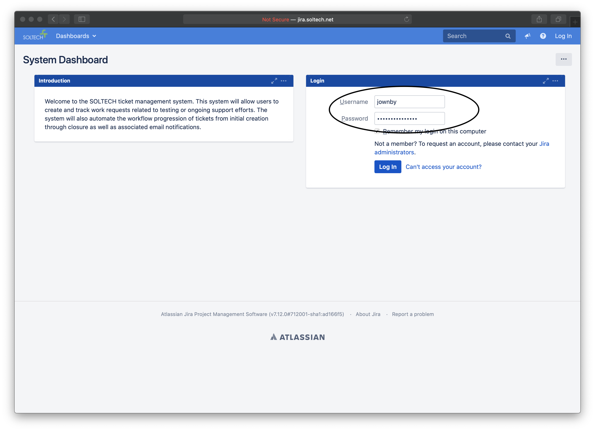
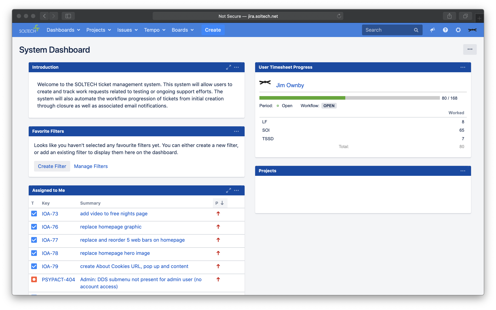
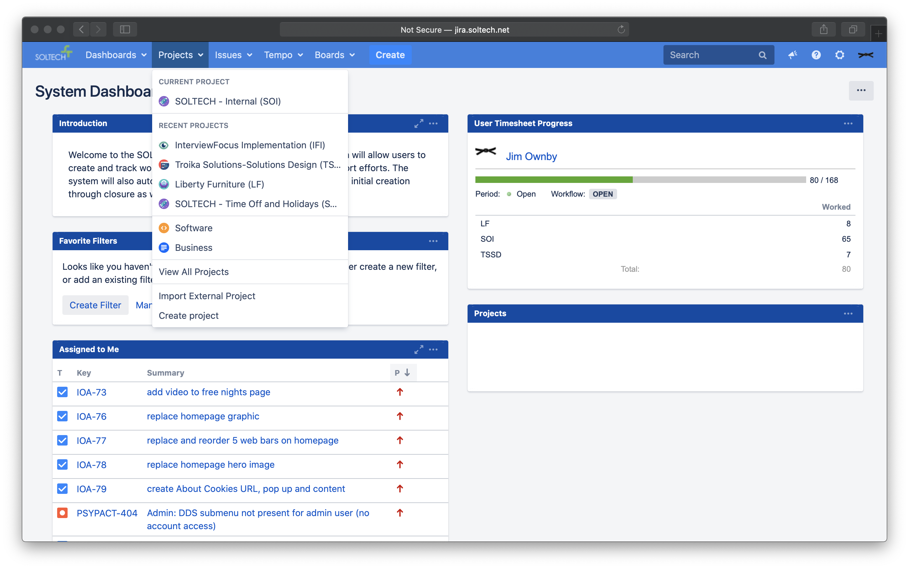
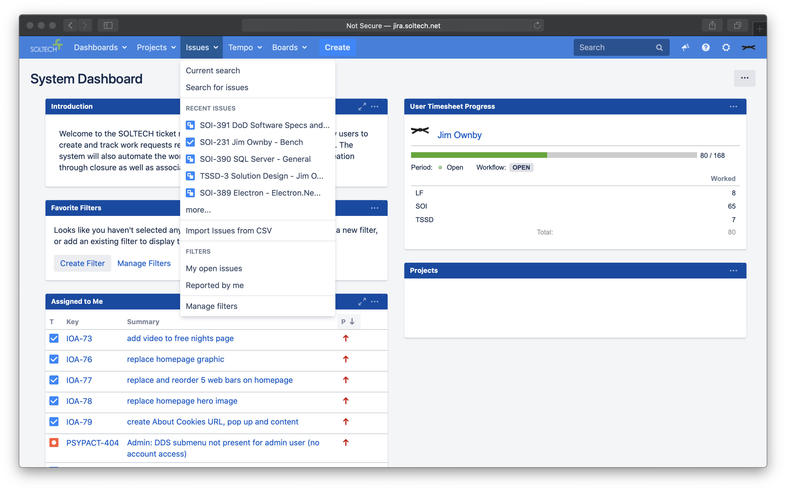
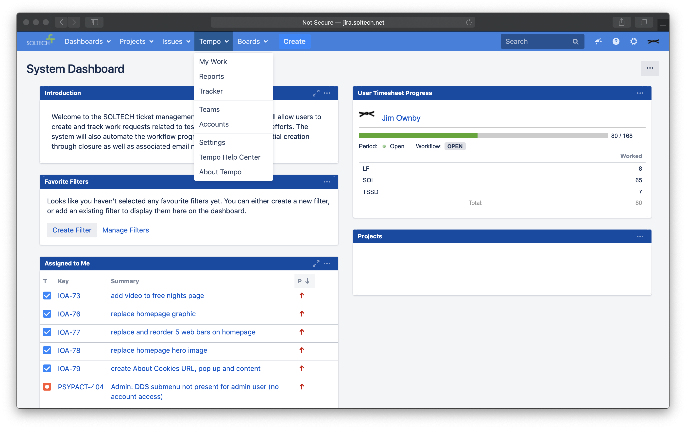
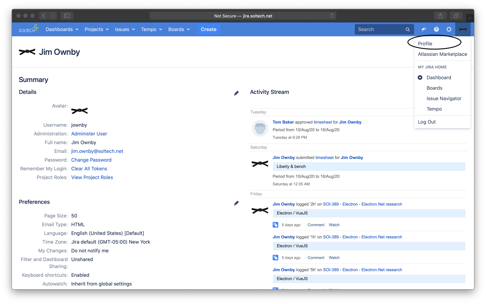
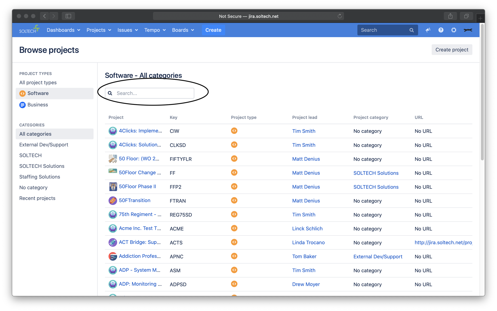
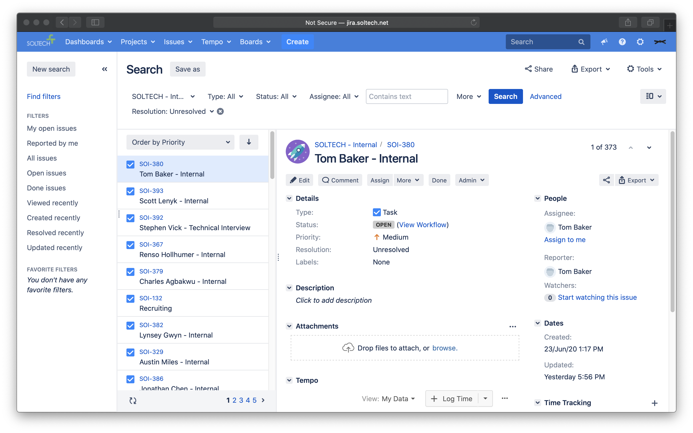

# Jira System Access

Jira is SOLTECH's main system for project management and time tracking.

## Getting Started

You should have received an email or printout with your Jira credentials. If not, please get with your on-boarding mentor to expedite that set-up.

1. Navigate to [jira.soltech.net] and you will see the standard login screen. (below)

1. This will bring you to the Jira Dashboard

1. From here, you can navigate to Projects, Issues, or the Tempo timekeeping areas

More information on Tempo can be found [here](Tempo_Timekeeping.md).

1. You can also access these areas from the Profile menu, as well as access your profile settings.

Here you can also change your password, profile avatar, etc.

1. Search By Projects

All SOLTECH projects are broken down into either Software- or Business-type projects. You can go to a list of each type to search generally for a particular project by entering the Project name or key into the search box at the top of the page.

Alternatively, if you have the project key already, you can navigate to `http://jira.soltech.net/projects/{project-key}` - with the appropriate key - and view the project directly.

1. Search by Issue

The Issue Navigator works similarly to the Project List but with more advanced filters available. There common filters available on the left-hand side menu or you can define your own. Any filter that you set for a search can be saved and recalled again later.
